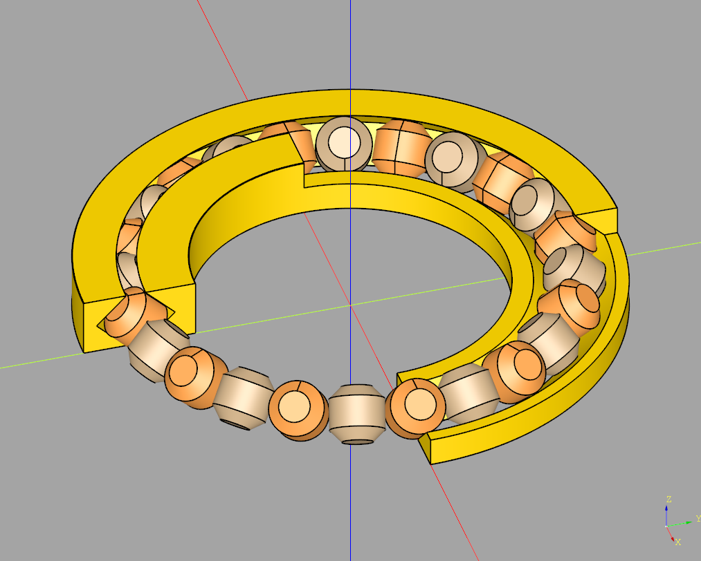

# Parametric Print-in-place Crossed Roller Slewing Bearing  

## Table of contents
* [General info](#general-info)
* [Glossary of Terms](#glossary-of-terms)
* [File Naming Convention](#file-naming-convention)
* [Running the Script](#running-the-script)
* [Printing](#printing)
* [Project Info](#project-info)
* [Endnotes](#endnotes)

## General info

This repository contains a Python script for generating a print-in-place crossed roller slewing bearing with any coherent dimensions using the [CadQuery](https://github.com/CadQuery/cadquery?tab=readme-ov-file#getting-started) module. It's been inspired by [this model](https://www.thingiverse.com/thing:2375124) but designed to require no assembly and with an easy option to iterate over variables. Use cases include "high" loads in any direction with low rotational speeds. Tolerances are adjustable, as they depend on the printing technology and material used.

|  | 
|:--:| 
| *Section view of 403.5x234x45 bearing with 24 rollers* |

## Glossary of Terms

| Term | Meaning |
|:-----|:--------|
| Print-in-place | An object can be printed as a single, fully assembled piece without the need for any post-print assembly. |
| Crossed Roller Slewing Bearing | A specialized type of bearing that consists of two races and a single row of cylindrical rollers arranged at right angles to each other, allowing it to support loads in multiple directions while providing high precision and rigidity. [This](https://cdn.thingiverse.com/renders/3e/43/cf/2c/64/3ff07d6844df8ace149842ba2ab988c5_display_large.jpg) sectional view represents the premise of this project. |
| Bearing Race | A ring with a groove that supports the rolling elements (in this case rollers). Usually divided into inner and outer races. |
| OD | Short for outside diameter - the outer diameter of the outer race of the bearing. |
| ID | Short for inside diameter - the inner diameter of the inner race of the bearing. |
| Bearing Width | The third dimension that describes a bearing. |
| Rollers Gap and Slide | To prevent material from fusing with itself, there needs to be some distance between adjacent walls. Rollers gap refers to the distance between two adjacent rollers, as well as between the roller's rolling surface and race surfaces. Rollers slide is the distance between the bases of the rollers and race surfaces. More on that in the [Testing](#testing) section. |

## File Naming Convention

The model files are named the following format:
```
b{OD}x{ID}x{Width}_{Rollers Gap}x{Rollers Slide}_{Number of rollers}.stl
```
The name carries information about the variables that you will be changing most frequently, as they have the most significant effect on the bearing's performance.

## Running the Script

If you don't want to generate your own bearings yet, go to the [Printing](#printing) section.

Having [CadQuery](https://github.com/CadQuery/cadquery?tab=readme-ov-file#getting-started) installed is **a must**. Depending on your installation, you might need to activate virtual environment first.

Clone this repository:
```
cd /path/to/folder
git clone https://github.com/xBartM/Parametric-Slewing-Bearing.git
cd ./Parametric-Slewing-Bearing
```
To execute the script, simply run:
```
python3 printinplaceslewbearing.py OD ID W RF RS
```
Where:
| Argument  | Description | Suggested Starting Values |
|:----------|:------------|:--------------------------|
| `OD` | `outer diameter` of the bearing | `50.0` |
| `ID` | `inner diameter` of the bearing | `15.0` |
| `W` | `width` of the bearing | `10.0` |
| `RF` | `roller fit` - rolling side dist between the rollers and dist to races | `0.3` |
| `RS` | `roller slide` - roller base side dist to races | `0.9` |

This table is also accessible via the `-h` argument.

The command will search for all bearings of specified dimensions with different numbers of rollers. If it exports 0 models, read the printed message carefully. If it exports only one model, you're all set and don't need to choose the version. Usually, the command will export a couple of models that differ by the number of rollers; more about this can be found in the [Testing](#testing) section. 

## Printing

|  | 
|:--:| 
| *A working 200x150x15 bearing with 44 rollers* |

This section applies to existing and custom models:
* The printer should be capable of printing perfect circles; otherwise, the bearing may bind before reaching optimal tolerances,
* Excessive stringing (any stringing should be considered excessive) will compromise the ability to break the rollers free,
* The bed should be leveled; an uneven bed will result in some rollers being deficient, as they usually start off as small 2mm x 2mm dots, 
* For bedslingers, bed acceleration does not seem to matter since the rollers are held in place by the races during printing.

### Existing models

In the `models/` folder, I've included `.stl` files for models I have printed (in PLA) on my 3D printer (Ender 3 S1 Pro), which worked well for me. Note that your printer/filament combination might perform differently, and you may need conduct some testing on your own. If you are unsure where to start, try printing the smallest bearing (smallest `OD`, `ID` and `Width`) with the largest tolerances (highest Rollers Gap and Slide), then go down with the tolerances until you're unable to break free the bearing.

### Slicing

1. Lay the bearing flat on the print bed.
2. Set the number of walls and top/bottom layers according to bearing size and required stiffness. During my testing, I set all parameters to `3` (using `0.2` line height (haven't had luck with `0.12`) and `0.4` line width).
3. Set an infill pattern to that is "3D", such as `cubic` (in Cura), and the density according to required stiffness (I printed with `20%` infill).
4. Turn off supports. While the first few layers feature steep overhangs, provided that rollers are as small as possible, this should not pose a problem. They will be somewhat distorted (more on that later), but I have yet to try printing a bearing with supports enabled.
5. If your print takes up most of the bed area, consider using a brim (in Cura) in order to minimize the chance of the print lifting from the bed on the edges. Make sure that the brim doesn't interfere with a gap between the races.

### Post-processing

1. Allow the print bed to cool down so that the bearing can pop off on its own without warping.
2. Check inside the bore (the space where a shaft would fit) for stringing.
3. Inspect roller quality; uneven bed, material build-up on the nozzle, poor overhang printing performance may deform them.
4. Break free the rollers:
    * push the inner race back and forth against the outer race,
    * push each roller in (e.g., with a flathead screwdirver),
    * insert something between the rollers and pry left and right (again, a small flathead screwdriver works well).
5. Break in the bearing - rotate the races in opposite directions for a minute (**note:** this may generate enough heat to deform rollers, especially if the tolerances are tight).
6. Apply lubricant - I've tried bike chain PTFE lube, but lithium grease works much better.
7. Keep in mind that operation will **not** be perfectly smooth.

## Project Info

The project is usable in its current form though not complete. I'll explain some of the work below so you can modify it at will.

### Design

In the `media/` folder, there are pictures of my notes. I used them to arrive at mathematical equations that ultimately led me to creating a usable design. I referenced [this video](https://www.youtube.com/watch?v=5o4Fj8OxkB8) to help me visualise the geometry.

First, I created the races. They are represented as a rectangle revolved around an offset vertical axis which is then cut by a square rotated 45 degrees. Next, I added chamfers on both outer and inner edges of the bearing. Last I removed some material from edges of races that are the closest to rollers.

Then, the roller is created by rotating a polygon from a set of points.

To obtain a complete assembly, each roller is rotated and translated into its final position and duplicated to pack as many of them as possible. Keeping the space between the rollers to a minimum is important to ensure as little wobble as possible. Same thing applies to the space between the roller and the raceway. Keep in mind that this will constrain the movement of the bearing.

If you want to delve deeper, take a look at the [Advanced](#advanced) section.

### Testing

Depending on your printing technology (e.g., FDM), printer and material (ex. PLA) you might achieve different results. Test printing is crucial for optimizing the design:
* While `OD`, `ID` and `width` are generally immutable, they influence each other more than in an ordinary bearing. `width` must be smaller than `(OD - ID)/2.0` as roller size depends on it and it cannot fit the races in a given space (ex. `200x150x20` bearing is still not possible because of that). On the other hand `(OD - ID)/2.0` being much bigger than `width` can lead to a bearing with too much leverage (in the event of axial and/or moment loads) and make it more prone to breaking. 
* By **eyeballing** it I'd say that the more rollers the higher the strength and longevity of the bearing at the cost of smoothness and ease of breaking it free. **Also** smaller rollers are (are they actually?) easier to print without supports, as the overhangs are thighter and don't span over too much of a distance.
* `RF` (`roller fit`) controls the spacing between rollers, and the distance from the roller to the raceway. You'd want to minimize it in the first place. It will make the bearing tighter and less wobbly, but harder to break loose after printing and will make it run with more resistance.
* `RS` (`roller slide`) controls the distance of the flat base of the roller to the raceway. Minimizing this might make the bearing more stable under load, but will make it harder to break loose and possibly easier to bind (or at least increase the resistance considerably) under heavier loads.
* there are more things that could be tweaked but I haven't gotten around to making them easily accessible. If you want finer control, take a look at [Advanced](#advanced) section (possibly before tuning `RF` and `RS`).

### Operation and Problems

Operation is not as smooth as you'd expect from a bearing, but in principle it's supposed to be used in scenarios of high load and low speed. I've yet to test it's operation under load, but after some preliminary, primitive testing it shows some promise.

In order to make it possible to print this bearing in place, so it doesn't require assembly, I had to make some suboptimal design decisions. One of them is that the rollers need to touch the build plate. This naturally strips us of an option to add dust covers (at least on one side). This means that debis and moisture can easily reach raceways and make them wear down faster (on the other hand it's a 3d printed bearing, what service life can we even expect?).

### Advanced 

I plan to expand on this design once I embark on a project that will actually use this bearing. Meanwhile you might find these variables handy for arriving at the perfect design for your use case (all in the code at the top of the class):
* `line_thickness` and `line_height` in FDM tell us about the thickness and height of a single extrusion line. They can be omitted, but (to me) it's easier to think of some design considerations in the terms of contraints placed by the technology of manufacturing.
* `inner_race_min_thickness` and `outer_race_min_thickness` control the minimal thickness of the inner/outer race in the skinniest part (at `0.5*width`).
* `roller_chamfer_min_length` is the length of the line that the roller makes contact with the bed. Another way of thinking about it is that it's the shorter side of a rectangle that we get by unwinding the chamfer face. So, the lower this number is, the harder it is to print the roller, but the more contact area the roller gets with raceways (so higher load capacity).
* `inner_race_chamfer` and `outer_race_chamfer` define how much of a chamfer to apply to the edges of inner/outer races.

Possible expansion points:
* rollers could be truncated cones as it's seen in Tapered Roller Bearings. Maybe I'll do the math and figure it out later.
* exporting could be more flexible with `.step` file handling.
* some more interactive ways of coming up with possible `ODxIDxW` dimensions could be added.

## Endnotes

The project is usable and will be expanded further if it turns out to be a valid solution to the problem of handling high loads at low rotational speeds using 3d printed bearings.

